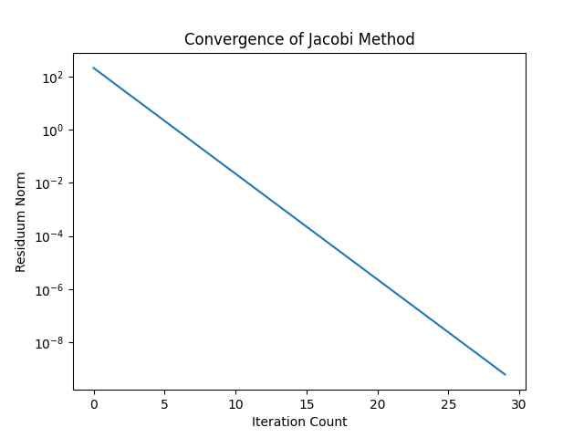

## Przegląd Projektu
Projekt implementuje i porównuje różne metody rozwiązywania układów równań liniowych:

1. **Metody iteracyjne**:
   - **Metoda Jacobiego**: opiera się na iteracyjnym przekształcaniu układu równań, zakładając przy każdej iteracji, że pozostałe niewiadome pozostają niezmienione.

     Notacja macierzowa:
     $$
     \mathbf{x}^{(k+1)} = D^{-1} (\mathbf{b} - (L + U)\mathbf{x}^{(k)})
     $$
     gdzie:
     A = D + L + U,

     D — macierz diagonalna,

     L — macierz dolnotrójkątna (z zerami na diagonali),

     U — macierz górnotrójkątna (z zerami na diagonali).

   - **Metoda Gaussa-Seidla**: ulepszona wersja metody Jacobiego, w której bieżące obliczenia są natychmiast wykorzystywane.

     Notacja macierzowa:
     $$
     \mathbf{x}^{(k+1)} = (D + L)^{-1} (\mathbf{b} - U\mathbf{x}^{(k)})
     $$

2. **Metoda bezpośrednia**:
   - **Rozkład LU**: polega na rozłożeniu macierzy $A$ na iloczyn macierzy trójkątnych:
     $$
     A = LU
     $$
     Następnie rozwiązujemy:
     $$
     L\mathbf{y} = \mathbf{b}, \quad U\mathbf{x} = \mathbf{y}
     $$

## Zadanie A
Skonstruowano układ Ax = b, gdzie:

- Macierz A ma rozmiar NxN z:
  - a1 = 5 + e (e = 6)
  - a2 = a3 = -1

- Wektor b ma elementy b_n = sin(n*(f+1)) (f = 7)

## Zadanie B
Zaimplementowano obie metody iteracyjne z kryterium stopu ||residuum|| < 1e-9.

{ width=50% }
{ width=50% }

---
### Wyniki:
- **Metoda Jacobiego**:
  - Wymagała ~30 iteracji

- **Metoda Gaussa-Seidla**:
  - Wymagała ~15 iteracji

Wykresy zbieżności pokazują stabilny spadek normy residuum dla obu metod.

## Zadanie C
Przetestowano metody z zmodyfikowanymi parametrami (a1=3, a2=a3=-1):

{ width=50% }
{ width=50% }

- Obie metody rozbiegały się:
  - Residuum Jacobiego wzrosło do ~1e123
  - Residuum Gaussa-Seidla wzrosło do ~1e146

Wniosek: macierz **nie jest już diagonalnie dominująca**.

## Zadanie D
Zaimplementowano metodę rozkładu LU:

- Osiągnięto normę residuum równą 1.58e-13 dla układu z Zadania C
- Zapewnia dokładne rozwiązanie, gdy metody iteracyjne zawodzą

## Zadanie E
Utworzono wykresy wydajności dla N = {100, 500, 1000, 2000, 3000}:

1. Skala liniowa pokazuje:
   - Metody iteracyjne szybsze dla małych N
   - Rozkład LU staje się kosztowny dla dużych N

2. Skala logarytmiczna ujawnia:
   - Złożoność $O(N^3)$ rozkładu LU
   - Lepsze skalowanie metod iteracyjnych

## Zadanie F

1. Zbieżność:
   - Metody iteracyjne zbieżne tylko dla niektórych macierzy
   - LU zawsze działa, ale jest kosztowne obliczeniowo

2. Wydajność:
   - Gauss-Seidel zazwyczaj szybszy niż Jacobi
   - LU najlepsze dla małych układów lub gdy potrzebna jest wysoka dokładność

3. Rekomendacje:
   - Małe układy: użyj LU
   - Duże układy: użyj metod iteracyjnych
   - Zawsze sprawdź warunki zbieżności
